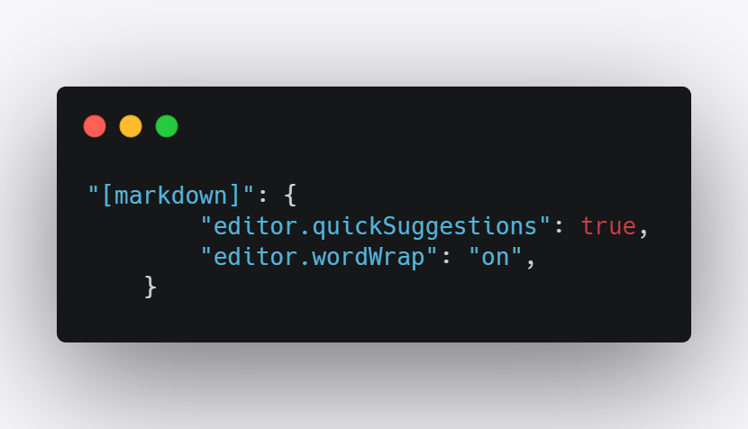

# Note for things I meet :copyright:
**Time Line**:clock9::clock11:
- [x] :date:2020-10-16 One week summary 

--- 
**Content**
<!-- vscode-markdown-toc -->
* 1. [Resources List](#ResourcesList)
* 2. [git](#git)
* 3. [vscode addon](#vscodeaddon)
* 4. [Assembly Language](#AssemblyLanguage)
* 5. [Operating System](#OperatingSystem)
	* 5.1. [内存虚拟化](#)

<!-- vscode-markdown-toc-config
	numbering=true
	autoSave=true
	/vscode-markdown-toc-config -->
<!-- /vscode-markdown-toc -->


##  1. <a name='ResourcesList'></a>Resources List
- [Emoij](https://github.com/zhangjw-THU/Emoji)
- [markdown doc](https://guides.github.com/features/mastering-markdown/)

##  2. <a name='git'></a>git

```shell
echo "# leetcode" >> README.md
git init
git add README.md
git commit -m "first commit"
git branch -M main
git remote add origin https://github.com/picturetxl/leetcode.git
git push -u origin main
```

+ `git init`  用来初始化,因为要用git这个工具去追踪文件的修改历史,所以如何记录这个历史信息,git需要创建一些文件去追踪,所以要进行git的初始化 即把当前目录变成git管理的仓库
+ `git add Readme.md` 用来将文件`Readme.md`添加到`stage area`
+ `git commit -m "first commit"`


+ `git branch -M main` #TODO: git branch ?
+ `git remote add origin https://github.com/picturetxl/leetcode.git` # TODO: origin ?
+ `git push -u origin main` # TODO: ?

##  3. <a name='vscodeaddon'></a>vscode addon
<details>
    <summary>vscode markdown snippet is not working </summary>

[solution](https://github.com/Microsoft/vscode/issues/28048)
:closed_book: 在settings.json下添加下面的代码,因为vscode 的markdown的snippet的触发默认是关闭的.需要添加下面的设置将其打开
```json
    "[markdown]": {
        "editor.quickSuggestions": true,
        "editor.wordWrap": "on",
    }
```

</details>

##  4. <a name='AssemblyLanguage'></a>Assembly Language
- :book: 《汇编语言(第3版)》-:handbag:王爽
- 学习环境: 8086CPU
- 每一种微处理器,由于硬件设计和内部结构的不同,就需要用不同的电平脉冲来控制,使它工作,所以每一种微处理器都有自己的机器指令集,也就是机器语言.
- 汇编指令是机器指令便于记忆的书写格式.
- CPU内部器件:
  - 寄存器: 8086CPU的所有寄存器都是16位的
       - 通用寄存器:`AX` `BX` `CX` `DX`
       - 段寄存器: `CS-代码段` `IP-指令指针`

- :unlock: :key:在内存或磁盘上,指令和数据没有任何区别,都是二进制信息.那么**CPU怎么知道是指令还是数据呢?**
  - [x] CPU只认被`CS:IP`指向的内存单元中的内容为指令

- 微机存储器的容量是以字节为最小单位来计算的.对于拥有128个存储单元的存储器,我们可以说,它的容量是128个字节.
- 总线:
  - 地址总线:用来寻址
  - 数据总线:数据传送.
    - 数据总线的宽度决定了CPU和外界的数据传输速度.
    - 8086CPU的数据宽度是16. 说明一次可以传送2个字节.
  - 控制总线:对外部期间的控制.
    - 控制总线的宽度决定了CPU对外部器件的控制能力.
- :round_pushpin: **add 进位丢失**
  - :unlock: add al,93H 若al是C5H, 那么add之后,158H,但是al是8bit寄存器,只能存放两位十六进制数,故ax的值为0058H.这里的丢失指的是进位值不能在8位寄存器中保存,但是CUP并不真的丢弃这个进位值. 
    - [ ] #TODO:
  - :large_blue_diamond: 如果执行add ax,93H,则低8位的进位会存储在ah中,CPU在执行这条指令时认为只有一个16位的寄存器.
- **在进行数据传送或运算时,要注意指令的两个操作对象的位数应当是一致的**
- :question: 在计算物理地址的时候,采用公式:**物理地址=段地址*16+偏移地址**,但是你做一个*16的操作后,比如1230H就变成了12300H,而寄存器是16bit的,也就是只能存4位十六进制数,但是此时存了5位.
  - [ ] #TODO:
- 改变CPU的行为
  - CPU从何处执行指令是由`CS` `IP`中的内容决定的.
  - 因此通过修改`CS` `IP` 的值来改变CPU的行为.
  - `jmp`指令:mov指令不可以直接修改`CS` `IP`中的值
    ```assembly
    jmp 2AE3:3 # jmp 段地址:偏移地址
    jmp ax     # jmp 寄存器 like move IP,ax
    ```
:date: 2020-10-16 <br> 
:checkered_flag: CH01 & CH02

--- 


---

##  5. <a name='OperatingSystem'></a>Operating System

###  5.1. <a name=''></a>内存虚拟化
- 
